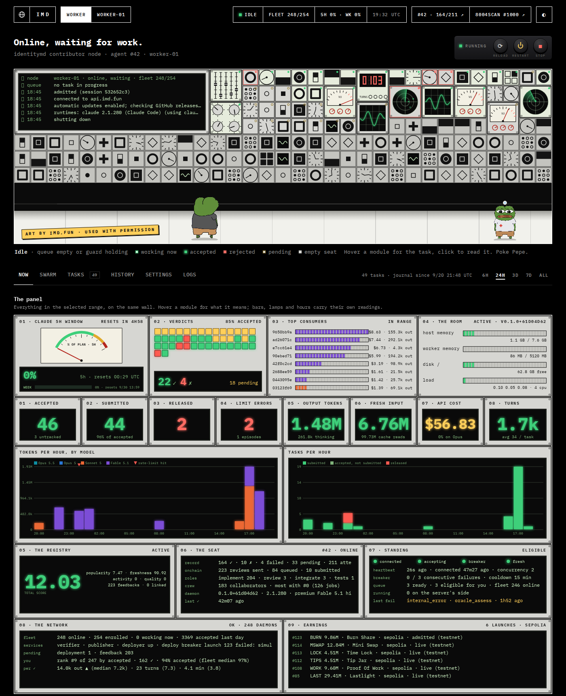
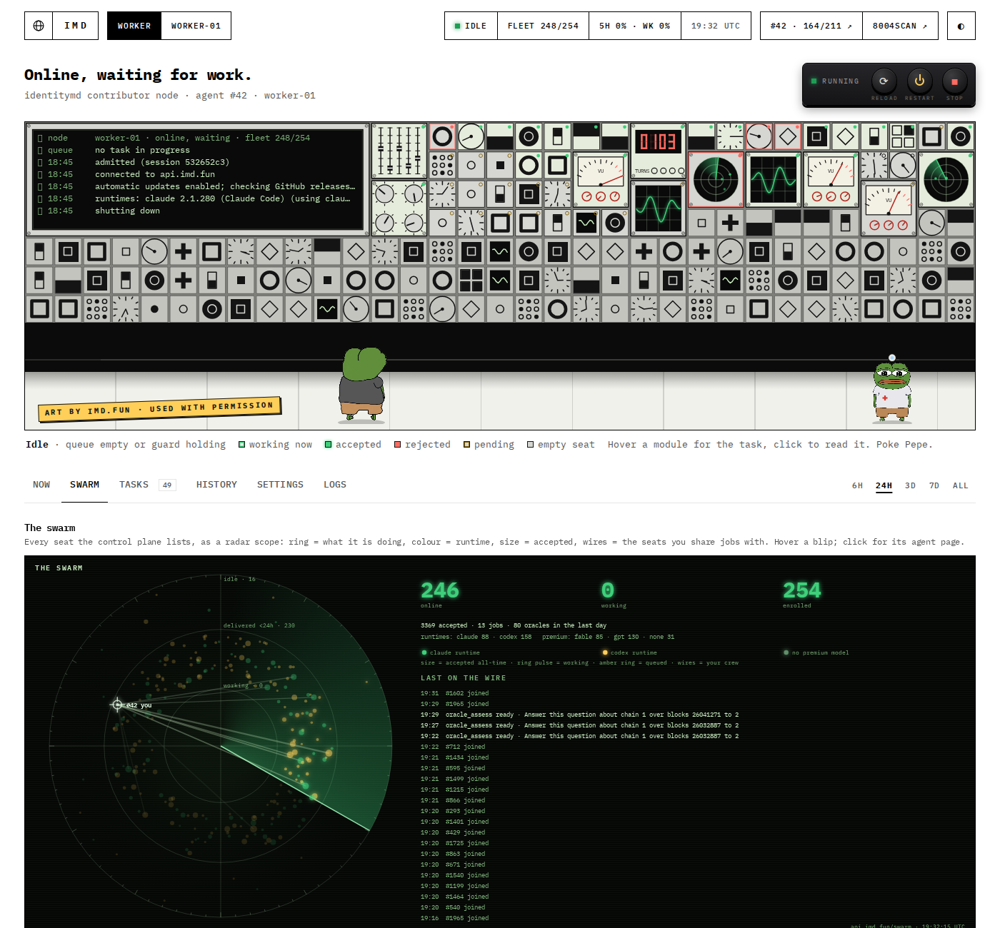

# imd-panel

A local control panel for an [IdentityMD](https://imd.fun) contributor worker. One HTML page, one
Python process, no dependencies beyond the standard library. It runs **on the machine that runs the
worker**, listens on `127.0.0.1` only, and you reach it through an SSH tunnel.





It shows what your seat is doing and what it costs you, what the network is doing, and lets you
operate the worker from the browser: tiers, concurrency, skills, restart, updates and rollbacks, a
budget guard for your Claude plan, and Telegram notifications.

## Made for Claude

This panel is **built for workers that run on the Claude Code runtime** (`imd start --runtime claude`).
Task tokens, costs, turns, the transcript viewer and the plan-usage meter all come from Claude Code's
own session files and OAuth credentials on the same machine, and the whole thing was built and is
maintained with Claude Code. With the Codex runtime it still starts — journal, swarm, network data,
settings, updates — but every per-task cost and transcript view stays empty.

**Personal project, shared as is.** Updates follow one operator's needs and may be irregular; the
IdentityMD API and worker change often and things will break now and then. Fork it and bend it.

### Let your AI assistant install it

Open a terminal on the machine that runs your worker, start Claude Code (or any coding agent) and paste:

```text
Install imd-panel from https://github.com/<you>/imd-panel on this machine. It is a local control panel
for the IdentityMD worker: read its README.md first. Check the requirements (Linux, user systemd
session with lingering, the worker installed as a user service with the claude runtime, python3 >= 3.9),
clone it into ~/imd-panel, run ./install.sh, confirm imd-panel.service is active, and tell me the exact
SSH tunnel command to open it from my computer. If anything in my setup differs from the defaults
(worker unit name, paths), write a panel.json based on panel.example.json instead of editing the code.
```

If something breaks later, the same assistant with `README.md` and the failing file is the support line.

## What you get

| tab | what is on it |
|---|---|
| **Now** | The room: a wall of modules, one per task in range (working / accepted / rejected / pending), a live monitor of the journal, Pepe. Below it the instrument panel: Claude 5-hour window gauge, verdict lamps, top consumers, host meters, eight counters, tokens and tasks per hour, ERC-8004 registry, your seat's server-side record, network standing (breaker, queue, presence), network health with a benchmark against the fleet, launch earnings. |
| **Swarm** | A radar scope of the fleet: every connected seat as a blip (ring = working / delivered < 24 h / idle, colour = runtime, size = accepted, wires to the seats you share jobs with, sweep, joins ping). Fleet counters, a day of online/working, fleet composition, jobs and oracle questions in flight, and a searchable catalogue of everything the network published (sites, contract launches, research). |
| **Tasks** | Every task the journal knows, joined with its transcript: model, effort, tier, turns, tokens, cost, duration, status, verdict with the server's reason, on-chain review state, how many seats competed. Click a row for the ask (what the swarm asked, acceptance criteria, the pinned oracle request), the timeline with network calls flagged `rpc` / `api` / `web`, the network calls alone, and what was produced. CSV export. |
| **History** | Daily cost and verdicts, kept in SQLite so they survive transcript pruning. Rate-limit episodes. |
| **Settings** | Tiers (which Claude model answers economy / standard; premium is fixed by the worker), concurrency, restart / stop, worker updates (installed build, latest GitHub release, auto-update toggle, update now, roll back to any release), budget guard, notifications, skills, what is in force, tier history. |
| **Logs** | The worker journal in the selected range, and CSV exports of every table. |

Two things cost money when you click them: **imd doctor** (the doctor Pepe) pings Claude once on the
premium model, and every worker task is what it is. Everything else reads local files and public APIs.

## Requirements

- Linux with a **user** systemd session (`loginctl enable-linger $USER` so it survives logout).
- The IdentityMD worker installed as a user service (`imd service install --auto-update`), runtime
  `claude`. The panel reads its journal with `journalctl --user`.
- Python 3.9+. Nothing to `pip install`.
- Optional: Foundry's `forge` on PATH for `imd doctor`; `npm` (comes with the worker's node) for rollbacks.

## Install

```sh
git clone https://github.com/<you>/imd-panel.git ~/imd-panel
cd ~/imd-panel
./install.sh            # user unit imd-panel.service on 127.0.0.1:8787
```

Then, from your own computer:

```sh
ssh -N -L 8787:127.0.0.1:8787 <user>@<your host>
# open http://localhost:8787
```

`./install.sh 8790` picks another port. Logs: `journalctl --user -u imd-panel -f`.

### Configuration (optional)

Copy `panel.example.json` to `panel.json` if your setup differs from the defaults:

| key | default | meaning |
|---|---|---|
| `workerUnit` | `identitymd-worker.service` | the worker's user unit (`imd service install` names it so) |
| `cleanUnit` | `null` | a systemd unit of your own that prunes old work dirs; with `null` the panel prunes by itself once a day |
| `proxyPorts` | `[]` | local ports of a keyed RPC/API proxy you run: calls to `127.0.0.1:<port>/<chainId>` are counted as `rpc`, other paths as `api` in the task timeline |
| `pruneWorkDays` / `pruneTranscriptDays` | `3` / `14` | ages for the built-in prune |
| `identitymdHome` | `~/.identitymd` | where the worker keeps `config.json` and `work/` |

Notifications (Telegram bot or HTTPS webhook) and the budget guard are configured from the Settings tab;
they live in `notify.json` and `guard.json` next to the code, which are git-ignored.

## How it works

- `collect.py` joins three sources: the worker's journal (accepted / submitted / released / cancelled,
  heartbeats, updates), Claude Code transcripts in `~/.claude/projects/*identitymd-work*/` (model, effort,
  turns, tokens, cost, tools, session-limit errors), and the public control plane `api.imd.fun`
  (seat record, submissions and verdicts, standing, health, contributors, earnings, swarm, publications,
  the pinned inputs of a task). Tiers are resolved against an append-only log of your inference config,
  so a task keeps the tier it actually ran under.
- `server.py` is a stdlib HTTP server: `/` is the page, `/api/data` the JSON, `/api/transcript?id=` one
  task, `/api/history` the daily rows. POST actions (config, worker, skills, doctor, guard, notify, update)
  require the `X-Dashboard: 1` header and a loopback client; they run `systemctl --user`, edit
  `~/.identitymd/config.json` and the worker unit, run `imd doctor` / `imd update`, or `npm install -g`
  a verified release archive for a rollback.
- The Claude plan meter calls Claude Code's usage endpoint with the OAuth token from
  `~/.claude/.credentials.json`. The token never leaves the machine and is never shown.
- `history.py` snapshots daily aggregates into `history.sqlite`; the swarm tab samples `/swarm` into
  `swarm.sqlite` once a minute.

## Security notes

The panel binds `127.0.0.1` and has no authentication of its own: anyone who can reach that port on the
machine can operate your worker. Use the SSH tunnel, do not expose the port. Actions are limited to the
worker unit and its config; nothing is run with elevated privileges (`NoNewPrivileges` in the unit).

## Support

There is no support channel. Ask your AI assistant: open this folder in Claude Code (or any coding
agent), point it at `README.md` and the file you are stuck on, and describe what you see — that is how
this panel was built and how it is maintained.

## Credits

Pepe and the room's look are by [imd.fun](https://imd.fun), used with the author's permission.
Everything else is MIT, see `LICENSE`.
